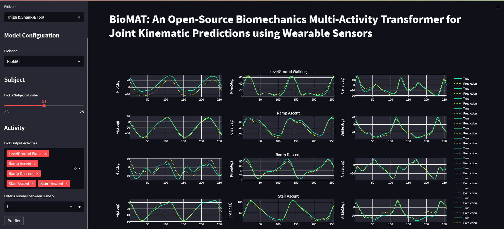

# BioMAT: An Open-Source Biomechanics Multi-Activity Transformer for Joint Kinematic Predictions using Wearable Sensors
<p align="center">
          <a href= "https://twitter.com/intent/tweet?text=BioMAT: An Open-Source Biomechanics Multi-Activity Transformer for Joint Kinematic Predictions using Wearable Sensors.&url=https://github.com/MohsenSharifi1991/BioMAT">
        </a>
          <a target="_blank" href="https://www.linkedin.com/shareArticle?mini=true&url=https://github.com/MohsenSharifi1991/BioMAT&title=BioMAT: An Open-Source Biomechanics Multi-Activity Transformer for Joint Kinematic Predictions using Wearable Sensors&summary=This repository includes the code for the BioMAT paper&source=https://github.com/MohsenSharifi1991/BioMAT">LinkedIn</a>
</p>

This repository includes the code for the [BioMAT paper](https://www.mdpi.com/1424-8220/23/13/5778), which can be found at Sensor. The repository has been influenced by the code found at https://github.com/timeseriesAI/tsai.

### Table of Contents
- [Installation](#installation)
- [Dataset](#dataset)
- [Runs](#runs)
- [BioMat App](#BioMat_App)
- [License](###license)

### Requirements
- Python >= 3.7
- PyTorch >= 1.8.1
- CUDA enabled computing device

### Installation
```
$ git clone git@github.com:mohsensharifi1991/BioMAT.git
$ cd BioMAT
$ pip install -r requirements.txt
```

### Dataset 
- You can download the current dataset from below:
https://digitalcommons.du.edu/biomat/
- The current dataset has been used the original dataset to form the pickle file and use in this project:
https://www.epic.gatech.edu/opensource-biomechanics-camargo-et-al/

### Runs
You can run the following to creat a pickle file dataset from the dataset from original dataset.
```
$ run_dataset_prepration.py
```
To train the model, run the following:
```
$ main_universal.py
```
To run hyper-parameter tuning you can use two methods:
- turn on the tuning variable in configs/camargo_config.json : `"tuning": true`, then run the following:
```
$ main_universal.py
```
- Using sweep, you can run hyper-parameter tuning. First modify the tuning variable in `configs/sweep_camargo_config.yaml`, then run the following:
```
$ run_sweep.py
```
### BioMAT App
To run the biomat app on streamlit:
```
$ streamlit run biomat.py
```

[](https://youtu.be/bKIoct3J-AM)
### References
Transformer Resource and Lib:
1. https://timeseriesai.github.io/tsai/models.TST.html#TST
2. https://timeseriestransformer.readthedocs.io/en/latest/README.html
3. https://github.com/maxjcohen/transformer
4. https://www.mdpi.com/1424-8220/23/13/5778
5. https://digitalcommons.du.edu/biomat/


### Citation
```
@article{Sharifi-Renani, M.; Mahoor, M.H.; Clary, C.W.
title = {BioMAT: An Open-Source Biomechanics Multi-Activity Transformer for Joint Kinematic Predictions Using Wearable Sensors},
journal = {Sensors},
year = {2023},
issn = {1424-8220},
doi = {https://doi.org/10.3390/s23135778},
url = {https://www.mdpi.com/1424-8220/23/13/5778},
author = {Mohsen Sharifi-Renani, Mohammad H. Mahoor, Chadd W. Clary},
}
```